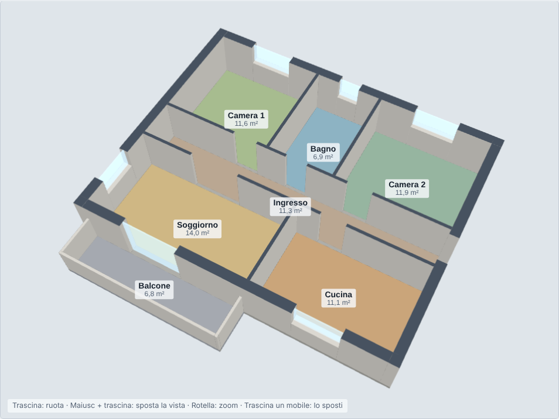

# Planner piante 3D

Pagina web a file singolo per trasformare una planimetria (foto, scansione, PDF o DXF) in un modello 3D navigabile, correggerne i muri, arredarla e salvarla. Non ha dipendenze da installare: tutto il codice è in un unico file HTML e il 3D è disegnato direttamente in WebGL.

## Come si usa

Apri `index.html` in un browser moderno (Chrome, Edge, Firefox, Safari). Funziona anche da disco, senza server. Per pubblicarla basta attivare GitHub Pages sul ramo principale.

All'avvio compare una pagina iniziale con tre strade:

- **Importa una pianta…** – parti da un'immagine, un PDF o un DXF.
- **Progetto salvato** – riapri un file `.json` salvato dalla pagina, o incollane il testo.
- **Apri l'esempio** – un appartamento inventato di circa 70 m², per provare gli strumenti.

Sotto compaiono i progetti già salvati in quel browser. Dentro un progetto il titolo è il nome del progetto e il pulsante «← Inizio» riporta alla pagina iniziale.

Per importare una pianta:

1. **Importa una pianta…** – scegli un'immagine, un PDF o un DXF.
2. **Imposta la scala** – trascina una linea sull'anteprima lungo una misura nota e scrivi i centimetri, oppure dichiara la scala (1:100, 1:200…) e i dpi. Per i DXF la scala viene letta dalle unità del file.
3. **Controlla l'anteprima** – i muri riconosciuti sono in rosso; soglia, spessore e modalità (muri pieni o a doppia linea) si possono regolare.
4. **Crea il progetto** e correggi quello che il riconoscimento ha sbagliato con gli strumenti della pagina.

## Funzioni

| Area | Cosa fa |
|---|---|
| Vista | Orbita 3D e vista dall'alto, altezza di taglio dei muri, etichette delle stanze, vetri. Caselle per nascondere **muri e aperture** e la **pianta di sfondo**. |
| Muri | Aggiungi muro (con aggancio ai muri vicini), taglia muri con un rettangolo, annulla, ripristina. |
| Aperture | Strumento «Porte e finestre»: un clic su un muro aggiunge un'apertura di larghezza standard, il trascinamento lungo il muro ne disegna una di larghezza libera. Di ogni apertura si cambiano tipo (porta, finestra, portafinestra, varco), larghezza, posizione lungo il muro, davanzale e altezza del vano; si può spostarla trascinandola ed eliminarla richiudendo il muro. |
| Misure | Trascina tra due punti per leggere la distanza; le misure restano sulla vista. |
| Mobili | Catalogo di mobili predefiniti e mobili su misura; sposta, ruota, duplica, elimina. |
| Stanze | Tabella delle superfici. Dopo una modifica ai muri, **Ricalcola le stanze** le ridefinisce dai muri attuali; i nomi si riscrivono nella tabella. |
| Progetti | Più progetti salvati nel browser; rinomina, elimina, cambia progetto. |
| Salvataggio | **Salva progetto** (`.json`), **Apri progetto salvato…**, **Incolla progetto…**, **Esporta DXF**, **Esporta PNG**. |

## Formati

**Ingresso**

- Immagini: PNG, JPG, WebP (foto o scansioni).
- PDF: letto con pdf.js, caricato da cdnjs solo quando serve. Se pdf.js non è raggiungibile, la pagina estrae l'immagine JPEG più grande contenuta nel PDF (tipico delle planimetrie catastali scansionate).
- DXF: entità `LINE`, `LWPOLYLINE`, `POLYLINE`, `ARC`, `CIRCLE`; unità da `$INSUNITS` o scelte a mano.

**Uscita**

- Progetto `.json`: muri, aperture, modifiche, mobili, stanze e immagine di sfondo. Struttura:
  `{app:"planner-piante-3d", v:1, name, ht, geo:{walls, ops, parapets, treads, rooms, w, d, img}, muri, aperture, mobili, vani}`.
  Coordinate in metri: `x` verso est, `z` verso il basso della pianta; i rettangoli sono `[x0, z0, x1, z1]`.
- DXF R12 ASCII con i layer `MURI`, `PARAPETTI`, `PORTE`, `FINESTRE`, `VANI`, `MOBILI`, `MISURE`.
- PNG della vista corrente con etichette e misure.

## Come funziona il riconoscimento

L'immagine viene portata a 1200 px sul lato lungo e passa per questi stadi:

1. Scala di grigi e normalizzazione locale dell'illuminazione (utile per le foto con ombre).
2. Soglia di Otsu.
3. **Esclusione delle scritte**: le componenti connesse piccole e allineate vengono raggruppate come testo e cancellate.
4. Stima dello spessore dei tratti per scegliere la modalità: muri *pieni* o *a doppia linea* (chiusura e apertura, resi comunque come muri pieni).
   Nei disegni a muri pieni lo spessore minimo viene messo a metà tra le linee sottili (arredi, ante, scale) e il muro più sottile, così restano anche i tramezzi. Vengono poi scartati la cornice del foglio, i pezzi piccoli staccati dall'edificio (legenda, scala grafica) e i simboli pieni come frecce e nord.
5. Scomposizione dei muri in rettangoli allineati agli assi.
6. **Porte e finestre**: interruzioni tra tratti di muro allineati; dove la pianta usa i trattini catastali, questi confermano le aperture. Nei disegni a muri pieni senza trattini, un vano che dà sull'esterno è una finestra, o una portafinestra se sul lato interno è disegnata l'anta; gli altri sono porte.
7. **Stanze**: riempimento su griglia da 4 cm delle zone chiuse da muri e aperture; restano fuori le zone aperte verso l'esterno e quelle sotto 0,6 m².

## Limiti noti

- Il modello usa solo muri allineati agli assi: i muri obliqui vengono approssimati a gradini.
- I muri a doppia linea sono il caso più debole e di solito richiedono correzioni a mano.
- Alcune aperture sfuggono o vengono classificate male (per esempio finestre con trattini inclinati): si correggono con un clic.
- Il ricalcolo trova solo le stanze chiuse: se una stanza manca, chiudi il varco con «Aggiungi muro» e ricalcola.
- La lettura dei PDF vettoriali con pdf.js non è stata verificata; è stato provato solo il percorso di ripiego con PDF scansionati.
- I progetti salvati nel browser restano legati a quella pagina e a quel browser: per spostarli usa «Salva progetto».

## File

| File | Contenuto |
|---|---|
| `index.html` | Pagina autonoma, da aprire nel browser o pubblicare su GitHub Pages. I file vengono scaricati direttamente. |
| `artifact/planner-piante-3d.html` | Stessa pagina nel formato degli artifact di Claude (senza involucro `<html>`); il salvataggio passa per la funzione di download del visualizzatore, con copia del testo come ripiego. |
| `anteprima.png` | Immagine di anteprima del progetto di esempio. |
| `LEGGIMI-esempio.md` | Misure dell'appartamento di esempio. |

Le due pagine hanno lo stesso codice: `index.html` aggiunge solo l'involucro HTML e poche righe che scaricano i file dal browser.

## Nota sui dati

Il progetto di esempio incluso nella pagina è un appartamento inventato e non corrisponde a un edificio reale. Le planimetrie che importi restano nel tuo browser: la pagina non le invia da nessuna parte.
